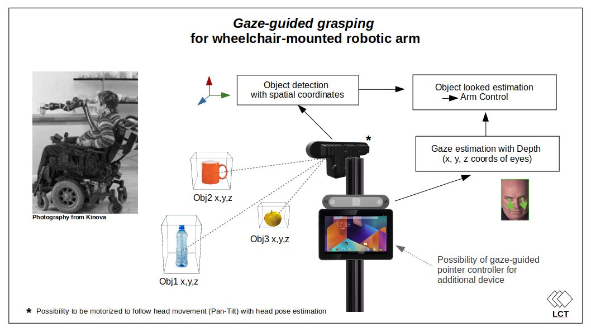

# Gaze-guided grasping for wheelchair-mounted robotic arm

Recent advances in AI are leading to major advances in robotics that will benefit service and assistance to people.

The new capabilities of robotics will improve the quality of life of many disabled people and more particularly those with severe disabilities.

Wheelchairs will become more and more robotic with the ability to navigate autonomously, open doors, grab objects, give people with severe disabilities the ability to eat on their own, ... in a nutshell, giving more autonomy to people with tetraplegia, which represents more than 100,000 people in the United States alone (NSCISC data, 2018).

There are already robotic arms mounted on wheelchairs that partially quadriplegic people can use more or less easily (the brain interface remains mainly in the field of research at this time). But using a robotic arm is not simple and requires constant attention. Unlike able-bodied people for whom the gesture is mostly done unconsciously (you don't have to think about how to open your hand to grab an object, or think about the precise movement to reach it).

As part of this challenge, we propose to develop a gaze-guided grasping for wheelchair mounted robotic arm to free the user from the complex manipulation and constant attention required for the use of the arm and thus improve the ease of use. More precisely, we offer assistance in reaching the objects, the final grasping phase being always a subject of research and we want to offer an immediately feasible solution.

## Method

### Object Looked Estimation model

For this objective, we will use two OAK-D (a limited POC can be done with one OAK-D), one directed in front of the user to estimate the direction of his gaze and determine the coordinates of his eyes (x, y, z ) and one in the opposite direction to detect the object in front of the user and their positions.

The Gaze Estimation model comes from Intel Openvino. The implementation on NCS2 by the single member of the LCT Robocare team has been ported to DepthAI by the Luxonis team. The NCS2 implementation can be found on Github here:  
<link rel="https://github.com/LCTyrell/Gaze_estimation" href="https://github.com/LCTyrell/Gaze_estimation">

The coordinates (x, y) and depth (z) position of the eyes will be determined using the stereo depth capability of the OAK-D and the landmark detection model already used as part of the gaze estimation model. For a full description, see the attached diagram.

Object detection with depth coordinates was a feature implemented very early by the Luxonis team and one of the reasons for the success of the OAK-D. It output bounding boxes, from the detected objects, located in space (x, y, z).

Afterward the two coordinate systems of the two OAK-Ds can be combined into one coordinate system. And then we can detect if the gaze direction intercepts any of the detected objects.

Finally, we can send the coordinates to a robotic arm, to reach the object, with a “classic” inverse kinematic algorithm.

Although this project is focused on creating the “Object Looked Estimation” model, if time permits, we will be doing a demo with a robotic arm on a simulation (Unity), and / or an inexpensive educational robotic arm (Poppy Ergo Jr). Both are ROS compatible.
More information about this on the project's Github page:
https://github.com/LCTyrell/Gaze_estimation.

This project is part of a larger reflection on robotic wheelchairs where the OAK-D or a variant could play a role: autonomous navigation, gaze-guided pointer controller for additional device, surveillance and security alert, collision avoidance...  

